# Eclipse で Git 用プラグインを使う

Eclipse には標準で **EGit** という Git クライアントが同梱されています。EGit を使用することで、 Eclipse から Git の様々な操作を行うことができます。

## 1. 準備

EGit を利用するには、専用のパースペクティブ（画面構成）を開くか、もしくは専用のビューを現在のパースペクティブに表示します。専用のパースペクティブを活用することで、その作業に必要なビューだけがウィンドウに表示され、不要なビューは隠されるため、作業効率を上げることができます。

#### Git 用のパースペクティブを開く場合

1. メニューから「ウィンドウ ⇒ パースペクティブ ⇒ パースペクティブを開く ⇒ その他」を選択します。

 

2. 表示されたサブウィンドウ内で「Git」を選択して、「開く」をクリックします。
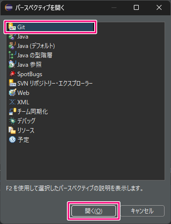
 

3. Git 操作用のパースペクティブが開きます。元のパースペクティブとの切り替えは、画面右上のボタンから行えます。
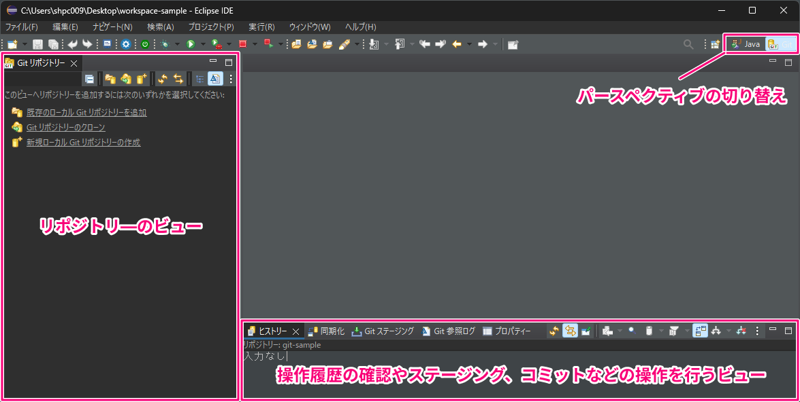
 

#### Git 用のビューを現在のパースペクティブに表示する場合

1. メニューから「ウィンドウ ⇒ ビューの表示 ⇒ その他」を選択します。
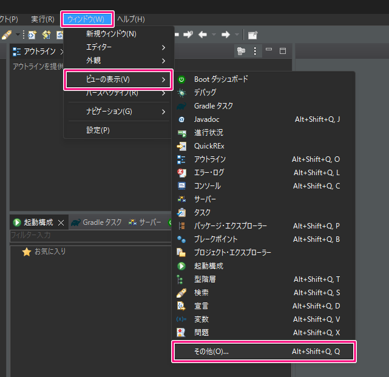
 

2. 表示されたサブウィンドウ内で「Git」下の全項目と「バージョン管理（チーム）」下の「ヒストリー」を選択して（※）、「開く」をクリックします。（※ Ctrl キーを押下した状態でクリックすると、複数の項目を同時に選択できます。）
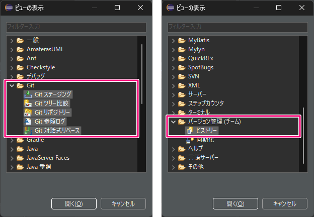
 

## 2. Git の操作

ここからは、Git 用のパースペクティブを開いた前提で操作方法を説明します。

### ローカルリポジトリの作成

既存の Java プロジェクトを Git の管理下に置く場合、次の手順で新たなリポジトリを作成します。この作業は Git Bash や PowerShell を使って、プロジェクトのフォルダをカレントディレクトリにして、 `git init` コマンドを実行するのと同じです。

1. 練習用に、Git で管理する新しい Java プロジェクトを作成します。**Java のパースペクティブに切り替えて作業を行ってください**。ここではプロジェクト名を「sample-egit」としています。
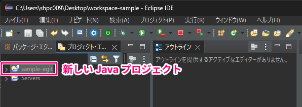
 

2. **Git のパースペクティブに切り替えて**、「Git リポジトリ―」のビューで「新規ローカル Git リポジトリーの作成」または図のアイコンをクリックします。
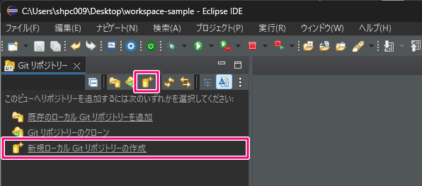
 

3. 1 で作成したプロジェクトのフォルダを選択し、デフォルト・ブランチ名を「main」に変更して「作成」をクリックします。デフォルトでは、別のディレクトリが選択されているので注意してください。
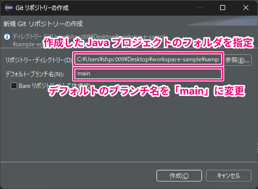
 

4. Git リポジトリーのビューに作成したリポジトリーが表示されます。Java プロジェクト下のフォルダやファイルが作業ツリーに追加されていることを確認してください。
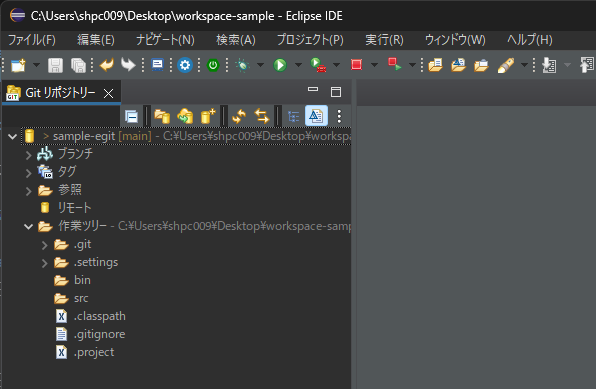

### 変更のステージングとコミット

変更のステージングとコミットは「Git ステージング」ビューで行えます。

1. 「Git リポジトリー」のビューで操作対象のリポジトリを選択し、下のパネルを「Git ステージング」のビューに切り替えます。
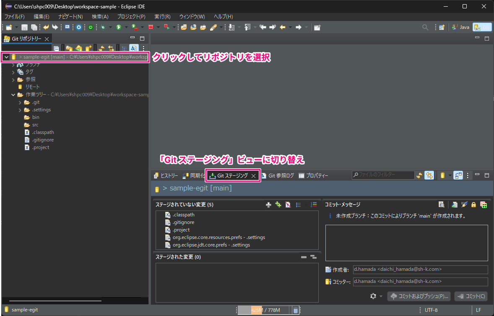
 

2. 選択したファイルのみ変更をステージする場合は「+」のアイコンをクリックします。すべての変更をステージする場合は「++」のアイコンをクリックします。
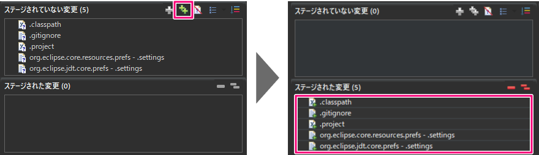
 

3. ステージされた変更をコミットする場合は、メッセージを入力して「コミット」をクリックします。
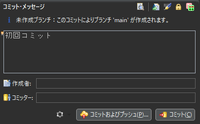
 

### ブランチの作成

上で作成した main ブランチから新しいブランチを作成します。

1. 「Git リポジトリー」のビューで、分岐元のブランチを選択し、右クリックで表示したメニューから「ブランチの作成」をクリックします。
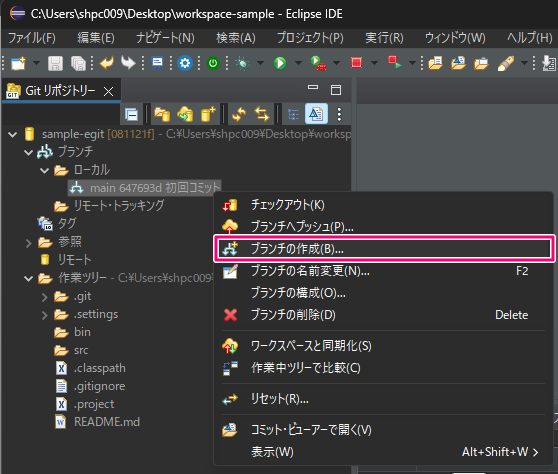
 

2. ブランチ名を入力し、「完了」をクリックします。このとき「新規ブランチをチェックアウトする」にチェックを入れると、作成したブランチが作業対象になるように HEAD の位置が切り替わります。
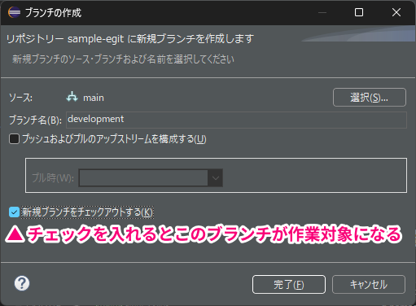
 

### チェックアウト

上で作成した development ブランチから、main ブランチへチェックアウトします。

- 「Git リポジトリー」のビューで、チェックアウト先のブランチを選択し、右クリックで表示したメニューから「チェックアウト」をクリックします。
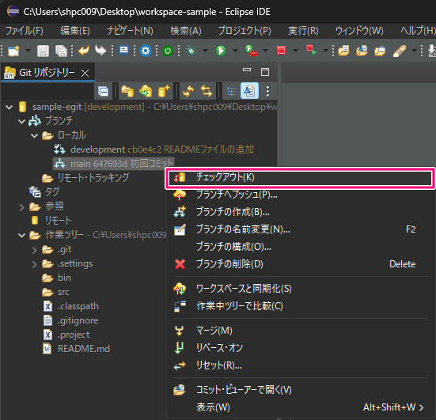
 

### マージ

development ブランチで作業を進め、変更内容を main ブランチへマージします。

1. チェックアウトを行い、 development ブランチに切り替えます。
2. 作業ツリーに新たに「README.md」名前でマークダウンファイルを追加します。このファイルの中身は空で構いません。
3. 「Git ステージング」のビューで、変更をステージし、コミットします。
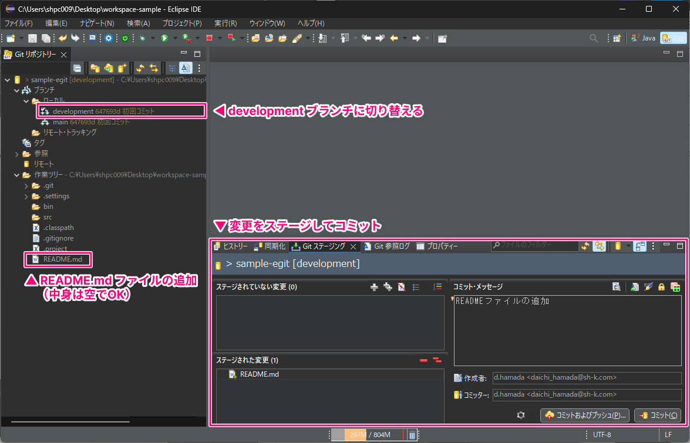
 

4. チェックアウトを行い、 main ブランチに切り替えます。
5. 右クリックで表示したメニューから「マージ」をクリックします。
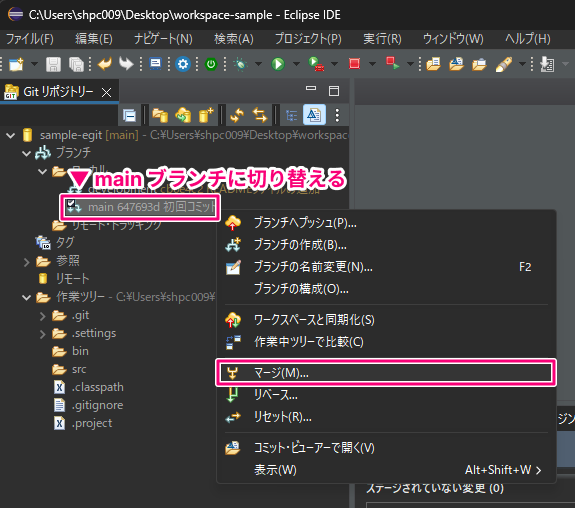
 

6. main ブランチへマージするブランチ（development）を選択し、「マージ」をクリックします。
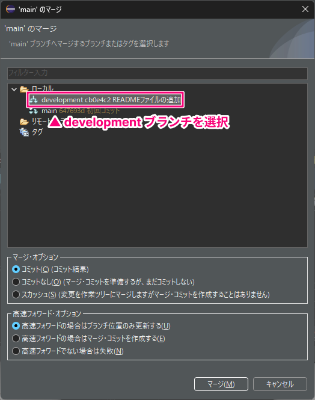
 

### ブランチ・ツリーの確認

過去のコミットやマージの履歴は、「ヒストリー」のビューからグラフィカルなツリーで確認することができます。

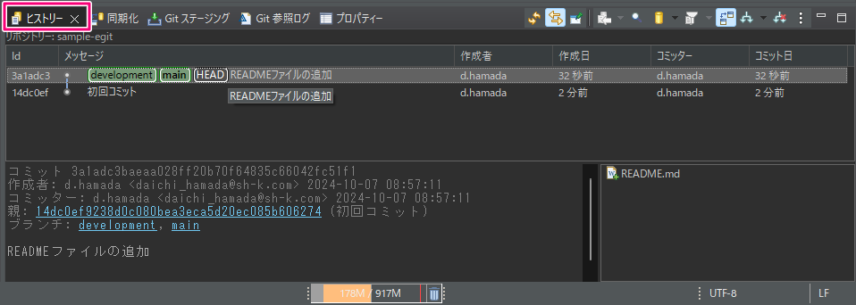

### 操作ログの確認

ブランチの作成やチェックアウト、コミットなど過去に行った操作のログは「Git参照ログ」のビューで確認できます。

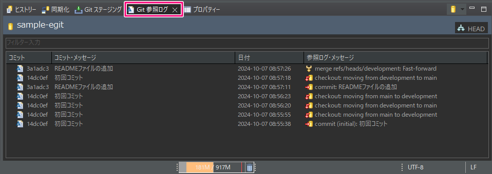

## 3. GitHub との連携

ここからは、GitHub 上のリポジトリと連携するための操作手順を説明します。

### リモートリポジトリをクローンする

GitHub 上に既に存在するリポジトリをクローンする場合、次の手順で操作します。

1. 「Git リポジトリー」のビュー内で右クリックをして表示したメニューから「Git リポジトリのクローン」を選択するか、もしくは図のアイコンをクリックします。
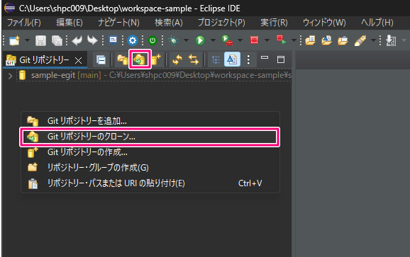
 

2. SSHで接続する場合は、クローンURIを選択して、「次へ」をクリックします。
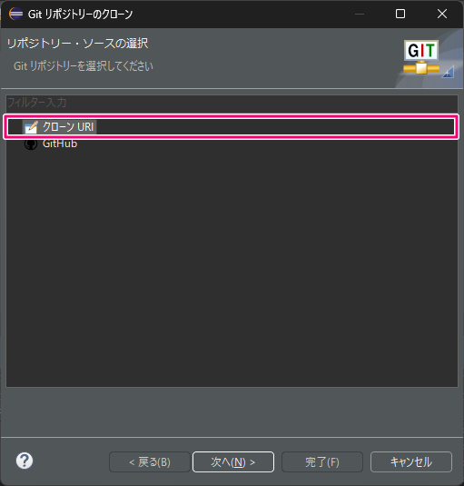
 

3. クローンしたいリポジトリのSSHのURIを入力します。その他の項目は自動で入力されるので、そのまま「次へ」をクリックします。
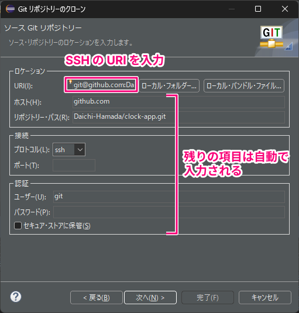
 

4. クローンするブランチを確認して、「次へ」をクリックします。
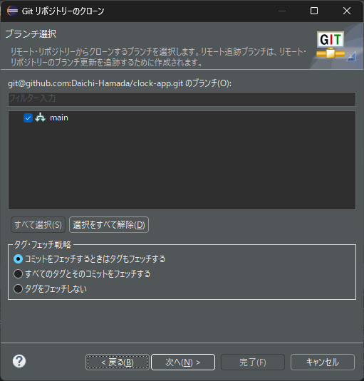
 

5. ローカルの保存場所となるワークスペースのフォルダを指定して、「完了」をクリックします。デフォルトではワークスペースが選択されていないので注意してください。
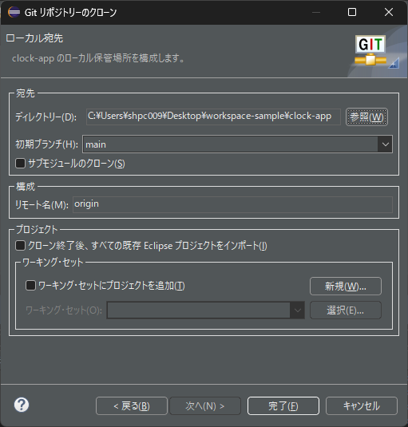
 

6. リポジトリがクローンされます。リモートリポジトリの変更を追跡するためのブランチも自動で追加されています。
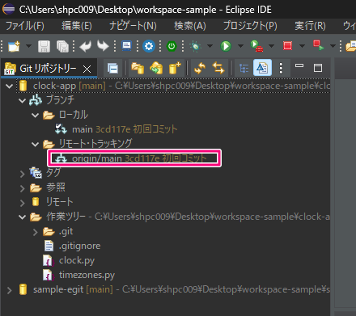
 

### 既存のローカルリポジトリにリモートを追加する

作成済みのローカルリポジトリに対して、新たに GitHub 上にリモートリポジトリを作成して連携する場合、次の手順で操作します。

#### リモートの追加

まずは、次の手順でリモートを追加します。

1. GitHub に新たに空のリモートリポジトリを作成します。
2. 「Git リポジトリー」のビューで、リモートを追加したいリポジトリを選択します。「リモート」の項目で右クリックをして、「リモートの作成」を選択します。
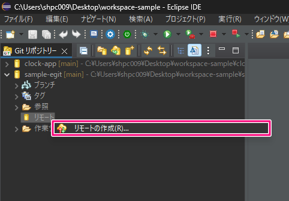
 

3. リモート名を入力して、「作成」をクリックします。自身のリポジトリの場合は「origin」とするのが慣例です。
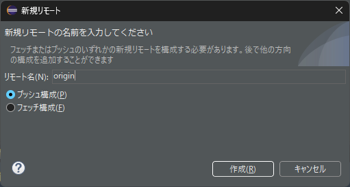
 

4. リモートの URI を指定するため、「変更」をクリックします。
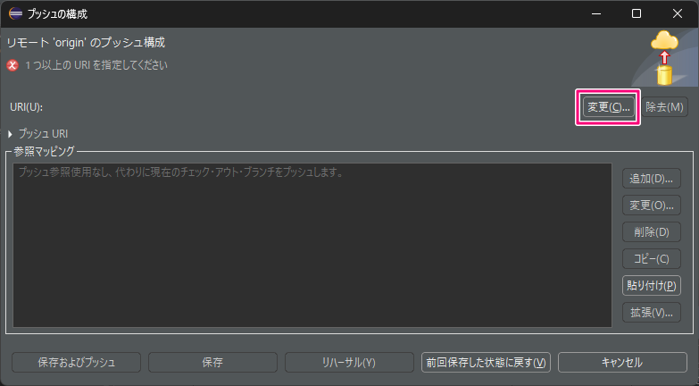
 

5. SSH の URI を入力します。その他の項目は自動で入力されるので、そのまま「完了」をクリックします。
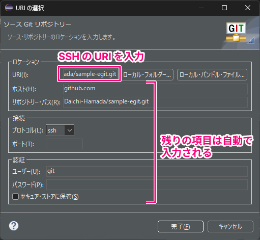
 

6. リモートリポジトリが空なので、「保存とプッシュ」をクリックして、リモートの追加とローカルのブランチのプッシュの両方を行います。

 

7. プッシュに成功すると、次のような画面が表示されます。内容を確認して「閉じる」をクリックします。
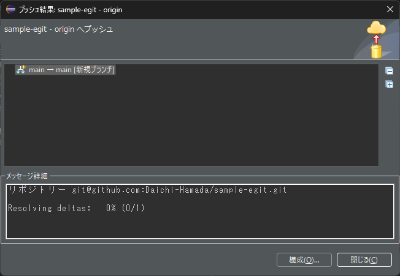
 

#### 追跡ブランチの作成

リモートリポジトリをクローンした場合と異なり、この方法ではリモート追跡ブランチが自動的に作られません。そのため、次の手順でリモート追跡ブランチを作成します。

1. リモート名の項目（ここでは「origin」）の直下にある項目（フェッチの項目）を選択して右クリックをします。表示されたメニューから「フェッチの構成」をクリックします。
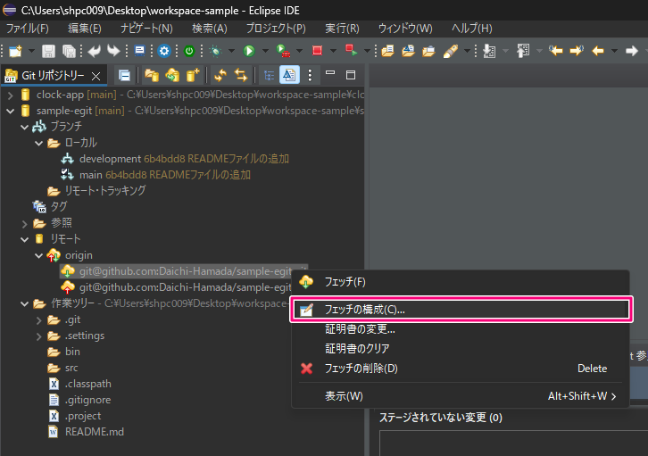
 

2. 「参照マッピング」の欄にある「追加」をクリックします。
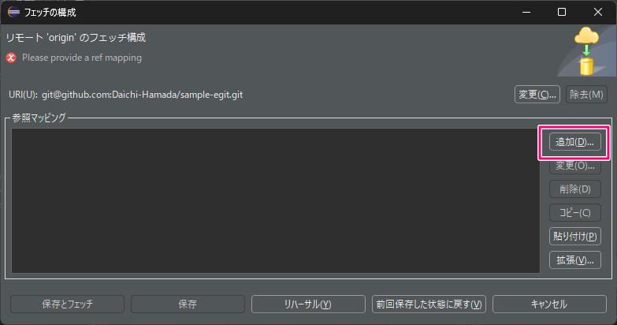
 

3. 追跡するブランチを選択します。ソースの欄に「main」と入力すると、選択肢が表示されるので、それをクリックすると自動で入力されます。確認ができたら、「次へ」をクリックして次に進みます。
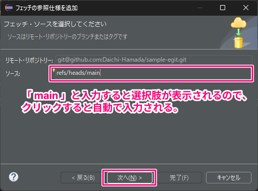
 

4. 内容を確認して、「完了」をクリックします。
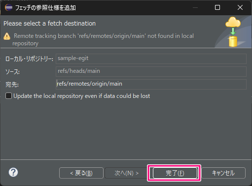
 

5. 参照マッピングにリモートのブランチが追加されていることを確認して、「保存とフェッチ」をクリックします。
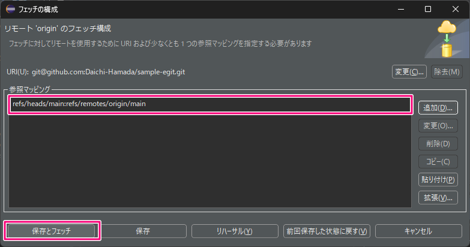
 

6. 無事にフェッチができると、次のように表示されます。「閉じる」をクリックしてこのウィンドウを閉じます。
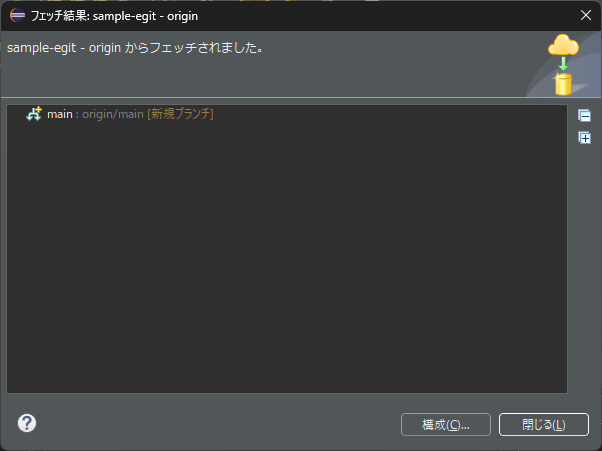
 

7. 「Git リポジトリー」のビューを確認すると、リモート・トラキングの項目に、リモート追跡ブランチが追加されていることが分かります。
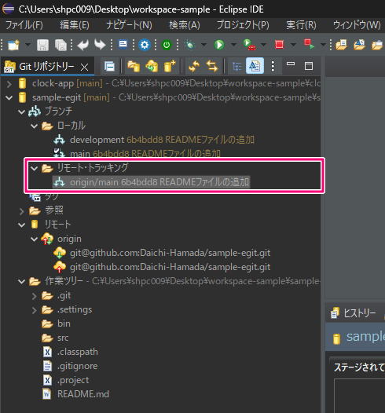
 

#### ローカルの変更をリモートにプッシュ

ローカルリポジトリに対して行った変更を一括してリモートにプッシュする場合、次の手順で操作します。

1. 「Git リポジトリー」のビューでプッシュ先のリモートを選択します。右クリックで表示したメニューから「プッシュ」を選択します。
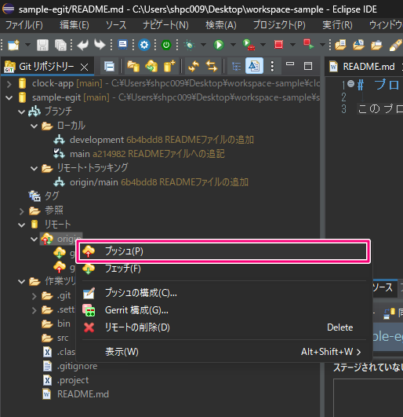
 

2. プッシュに成功すると、次のような表示が出ます。内容を確認して「閉じる」をクリックしてウィンドウを閉じます。
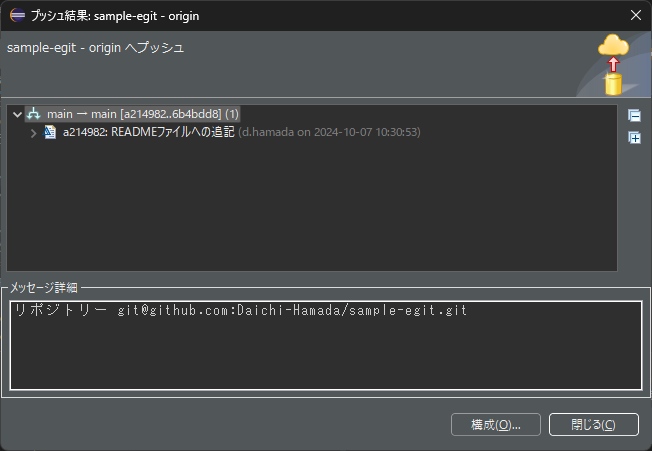
 

#### リモートの変更のフェッチとローカルへのマージ

リモートリポジトリに対して行われた変更をローカルに反映する場合、次の手順でフェッチとマージを行います。

1. 「Git リポジトリー」のビューでプッシュ先のリモートを選択します。右クリックで表示したメニューから「フェッチ」を選択します。
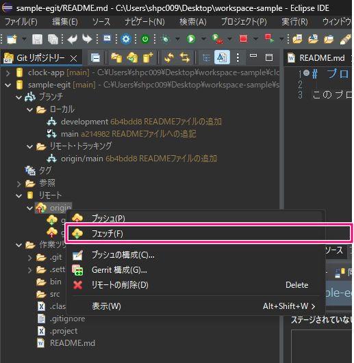
 

2. フェッチに成功すると、次のような表示が出ます。内容を確認して「閉じる」をクリックしてウィンドウを閉じます。
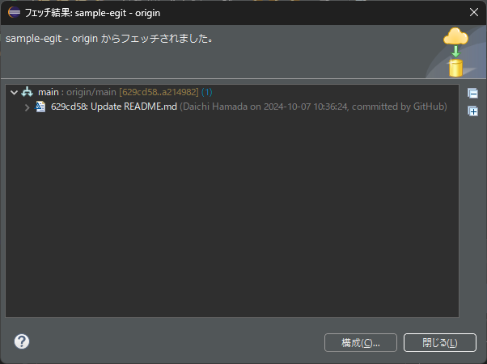
 

3. フェッチによって更新されたリモート追跡ブランチをローカルのブランチにマージします。マージ先のブランチを選択して、右クリックで表示したメニューから、「マージ」をクリックします。
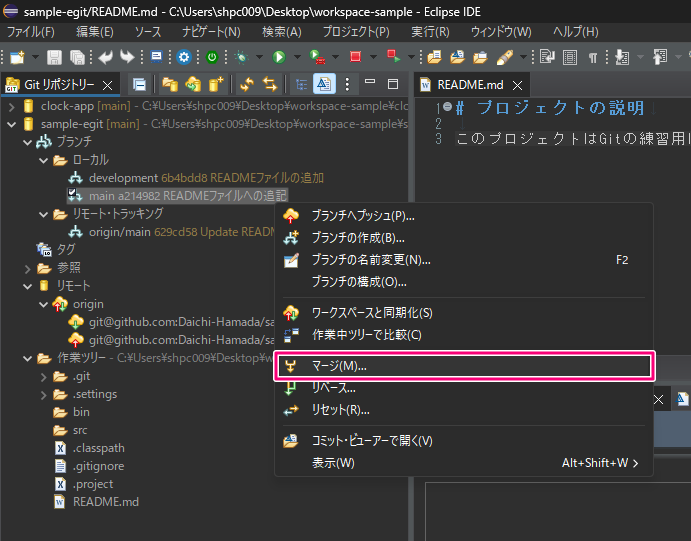
 

4. マージするリモート追跡ブランチを選択して、「マージ」をクリックします。
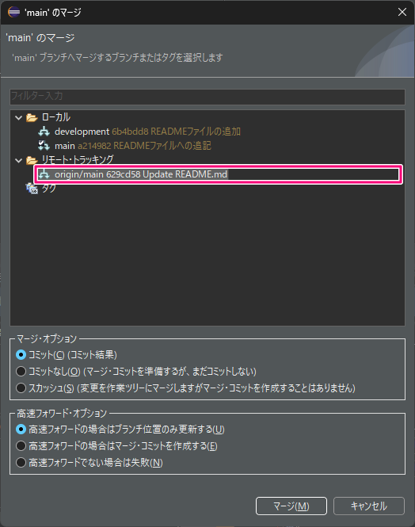
 

5. コンフリクトがなく、マージに成功すると、次のような表示が出ます。内容を確認して「OK」をクリックします。
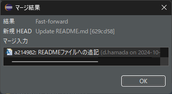
 