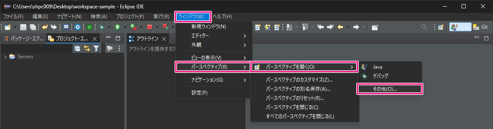

# Eclipse で Git 用プラグインを使う

Eclipse には標準で **EGit** という Git クライアントが同梱されています。EGit を使用することで、 Eclipse から Git の様々な操作を行うことができます。

## 1. 準備

EGit を利用するには、専用のパースペクティブ（画面構成）を開くか、もしくは専用のビューを現在のパースペクティブに表示します。専用のパースペクティブを活用することで、その作業に必要なビューだけが表示され、不要なビューは隠されるため、作業効率を上げることができます。

#### Git 用のパースペクティブを開く場合

1. メニューから「ウィンドウ ⇒ パースペクティブ ⇒ パースペクティブを開く ⇒ その他」を選択します。

 

2. 表示されたサブウィンドウ内で「Git」を選択して、「開く」をクリックします。

 

3. Git 操作用のパースペクティブが開きます。元のパースペクティブとの切り替えは、画面右上のボタンから行えます。

 

#### Git 用のビューを現在のパースペクティブに表示する場合

1. メニューから「ウィンドウ ⇒ ビューの表示 ⇒ その他」を選択します。

 

2. 表示されたサブウィンドウ内で「Git」下の全項目と「バージョン管理（チーム）」下の「ヒストリー」を選択して（※）、「開く」をクリックします。（※ Ctrl キーを押下した状態でクリックすると、複数の項目を同時に選択できます。）

 

## 2. Git の操作

ここからは、Git 用のパースペクティブを開いた前提で操作方法を説明します。

### ローカルリポジトリの作成

既存の Java プロジェクトを Git の管理下に置く場合、次の手順で新たなリポジトリを作成します。この作業は Git Bash を使って、プロジェクトのフォルダがカレント `git init` コマンドを実行するのと同じです。

1. 練習用に、Git で管理する新しい Java プロジェクトを作成します。**Java のパースペクティブに切り替えて作業を行ってください**。ここではプロジェクト名を「sample-egit」としています。

 

2. **Git のパースペクティブに切り替えて**、「Git リポジトリ―」のビューで「新規ローカル Git リポジトリーの作成」または図のアイコンをクリックします。

 

3. 1 で作成したプロジェクトのフォルダを選択し、デフォルト・ブランチ名を「main」に変更して「作成」をクリックします。

 

4. Git リポジトリーのビューに作成したリポジトリーが表示されます。Java プロジェクト下のフォルダやファイルが作業ツリーに追加されていることを確認してください。

### 変更のステージングとコミット

変更のステージングとコミットは「Git ステージング」ビューで行えます。

1. 「Git リポジトリー」のビューで操作対象のリポジトリを選択し、下のパネルを「Git ステージング」のビューに切り替えます。

 

2. 選択したファイルのみ変更をステージする場合は「+」のアイコンをクリックします。すべての変更をステージする場合は「++」のアイコンをクリックします。

 

3. ステージされた変更をコミットする場合は、メッセージを入力して「コミット」をクリックします。

 

### ブランチの作成

1. 分岐元のブランチを選択し、右クリックで表示したメニューから「ブランチの作成」を選択します。

 

2. ブランチ名を入力し、「完了」をクリックします。このとき「新規ブランチをチェックアウトする」にチェックを入れると、作成したブランチが作業対象になるように HEAD の位置が切り替わります。

 

### チェックアウト

### マージ

1. 

 

2. 

 

3. 

 

### ブランチ・ツリーの確認

### 操作履歴の確認

## 3. GitHub との連携

